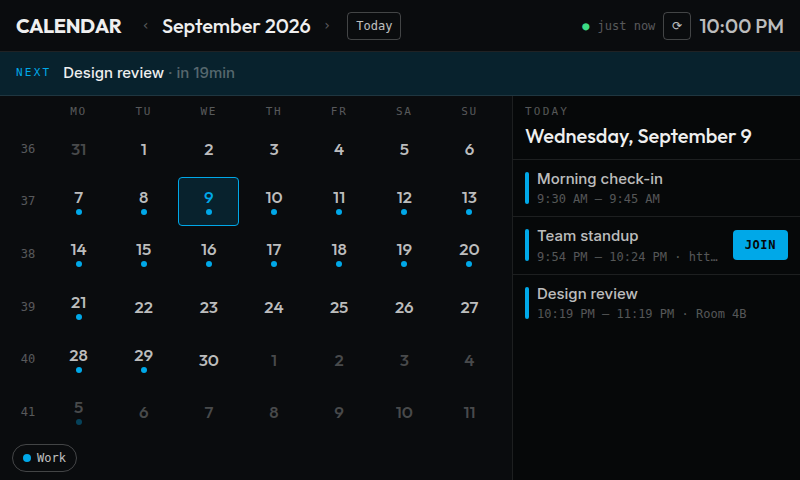

# Calendar for Bridgething

Your calendars on the Spotify Car Thing. Month view, agenda, next-event countdown, and one-tap join for meetings — powered by plain iCalendar (ICS) feeds, so it works with Google Calendar, Apple Calendar, Nextcloud, or anything that publishes an `.ics` URL.



## Features

- Six-row month grid with event dots, ISO week numbers, and Today shortcut
- Selected-day agenda with times, locations, and all-day events
- Next-event countdown banner with one-tap **Join** for Google Meet, Zoom, Teams, Webex, GoToMeeting, and Chime links
- Event detail view with description and location
- Full ICS support: recurring events (RRULE), timezones (TZID), EXDATE, recurrence overrides, multi-day events
- Multiple feeds with per-calendar colors and visibility filters
- Knob / arrow-key month navigation, auto-refresh, companion-app settings

## Setup

1. Install the app on your Car Thing.
2. In the Bridgething companion app, open Calendar settings and paste one HTTPS iCalendar URL per line into **iCalendar feed URLs**. (Google Calendar: Settings → Integrate calendar → "Secret address in iCal format". Apple: share the calendar publicly and use the webcal URL as https.)
3. The app syncs on launch and refreshes every 15 minutes.

## Development

```sh
bun install
bun run typecheck   # tsc
bun run build       # vite build → dist/
bun run dev         # local dev server
```

Unit tests (ICS parser, recurrence, date math) run without a browser:

```sh
bun tests/run.ts
```

For a quick visual test without a device, serve `dist/` and point the app at a local feed:

```sh
# from the repo root
bun run build && (cd dist && python3 -m http.server 8123)
# then open http://localhost:8123/?ics_feeds=http://localhost:8123/sample.ics
```

## Attribution

The month-grid interaction model and several date helpers are ported from [omarchy-calendar](https://github.com/tmn73/omarchy-calendar) by tmn73, MIT licensed. See [LICENSE](LICENSE).

## License

MIT — see [LICENSE](LICENSE).
