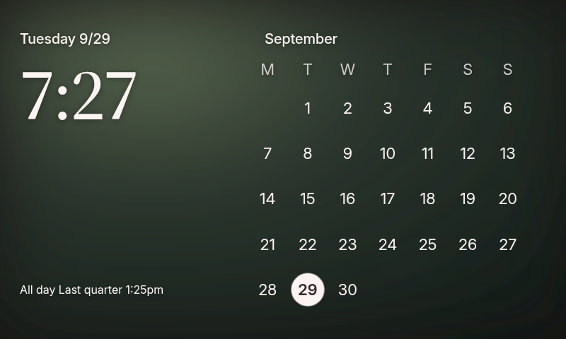
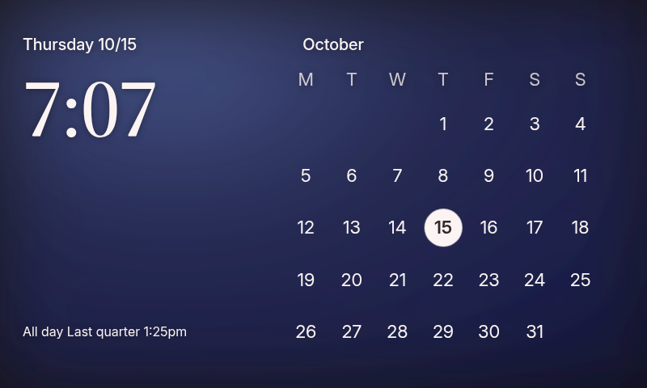

# Calendar for Bridgething

Your calendars on the Spotify Car Thing. Month view, big clock, and a next-event line — powered by plain iCalendar (ICS) feeds, so it works with Google Calendar, Apple Calendar, Nextcloud, or anything that publishes an `.ics` URL.




## Features

- Big live clock with the current date and a next-event line
- Month grid with today highlighted; knob/arrow-key navigation
- Day tap / knob press opens the day's events; event detail with description and location
- Full ICS support: recurring events (RRULE), timezones (TZID), EXDATE, recurrence overrides, multi-day events
- Multiple feeds, separated by `;`
- Daily background photo (Unsplash landscapes) with automatic text-contrast adjustment
- Warm dark theme (default) and light theme; dialogs always dark

## Controls

**Car Thing hardware buttons:**
- **Preset 1** (or `1` / `F1`): Toggle theme (dark / light)
- **Preset 2** (or `2` / `F2`): Force-refresh the background photo

**Knob:**
- **Turn**: Move the focused date (left/right = day, up/down = week; crossing month edges steps months)
- **Press**: Open the focused day's events (press again or ESC to close)
- **Long-press (hold 600ms)**: Jump back to today, with a smooth animation

## Setup

1. Install the app on your Car Thing.
2. In the Bridgething companion app, open Calendar settings.
3. In **iCalendar feed URLs**, paste your ICS URLs separated by `;` (semicolon). Example:
   ```
   https://calendar.google.com/calendar/ical/abc123/basic.ics;https://example.com/holidays.ics
   ```
   Whitespace around the `;` is ignored.
4. The app syncs on launch and refreshes automatically.

**Tip:** Google Calendar: Settings → Integrate calendar → "Secret address in iCal format". Apple Calendar: share the calendar publicly and use the webcal URL as https.

## Settings

- **iCalendar feed URLs** (`ics_feeds`): `;`-separated ICS URLs (see above)
- **Week start** (`week_start`): First day of the week (Monday or Sunday)
- **Countdown minutes** (`countdown_minutes`): Show a countdown for events starting within this many minutes
- **Refresh interval** (`refresh_minutes`): How often to re-fetch feeds
- **Theme** (`theme`): Dark (default) or light. Can also be toggled with hardware Preset 1.

## Background

A random landscape photo is fetched daily from Unsplash (no API key needed) and cached per day. The app automatically adjusts text brightness for readability based on the photo behind each panel (left date panel and right calendar grid are analyzed independently). Press hardware Preset 2 to pull a fresh photo immediately.

## Development

```sh
bun install
bun run typecheck   # tsc
bun run build       # vite build → dist/
bun run dev         # local dev server
```

Unit tests (ICS parser, recurrence, date math) run without a browser:

```sh
bun tests/run.ts
```

## Attribution

The month-grid interaction model and several date helpers are ported from [omarchy-calendar](https://github.com/tmn73/omarchy-calendar) by tmn73, MIT licensed. See [LICENSE](LICENSE).

## License

MIT — see [LICENSE](LICENSE).
